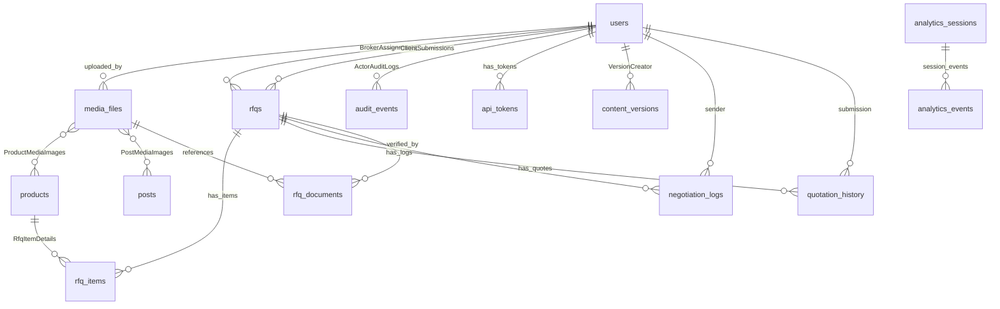

# ESLAMI GLOBAL TRADING — ENTERPRISE DATABASE ARCHITECTURE & HARDENING BLUEPRINT
### بازرگانی اسلامی — سند جامع معماری، امنیت و توسعه پایگاه‌داده مقیاس‌پذیر تولیدی

---

## EXECUTIVE SUMMARY

This reference architecture document presents the definitive, production-hardened transition path for the **Eslami Global Trading // بازرگانی اسلامی** portal. It bridges our highly functional, in-memory local sandbox state system (`db.json` driven by `db.ts`) with a highly scalable, high-availability, fully encrypted enterprise architecture using **PostgreSQL 16+** and the **Prisma ORM**.

This schema and blueprint have been structurally engineered to handle multi-broker routing, Incoterms 2020 cargo workflows, millisecond-latency multilingual GIN search triggers, strict compliance auditing, and secure B2B client sandboxing.

---

## 1. ARCHITECTURAL CURRENT-STATE REVIEW & RETROSPECTIVE

### 1.1 Current Architecture: In-Memory JSON State (`src/db.json` & `src/db.ts`)
The initial prototyping layer has been highly effective for development:
- **How it works:** A filesystem database where all datasets are loaded as memory-bound Javascript runtime objects. Updates trigger synchronized atomic file writes via Node’s `fs.writeFileSync`.
- **Strengths:** Zero complex dependencies, lightweight, responsive local execution, straightforward mock backups, immediate sandbox portability.

### 1.2 Core Critical Vulnerabilities in Production
Before going live on a production lsp/VPS instance, reliance on the in-memory JSON state model poses major architectural risks:
1. **Lack of ACID Compliance:** No transaction isolation. Concurrent updates to `src/db.json` can cause file race-conditions, resulting in database corruption.
2. **Scale Barriers:** As visitor logs, RFQ records, and media volumes scale to gigabytes, parsing the entire JSON structure on app boot will choke server RAM.
3. **Plainpassword Vulnerabilities & Outdated Security:** The prototype utilized a separate `salt` column alongside a custom SHA-256 hash. Modern cryptographic standards mandate integrated adaptive hashing algorithms (Argon2id/bcrypt) which generate and manage salts internally.
4. **Audit and Compliance Blindness:** Standard JSON logging has no snapshot trace (before/after states), making forensic security checks impossible.
5. **No Thread Concurrency:** Node.js file write operations block threads or require queuing middleware to suppress file locked alerts under multi-user access.

---

## 2. ADVANCED RELATIONAL SYSTEM ERD (MERMAID SPECIFICATIONS)

This unified database entity relationship diagram displays the core relationships (One-to-Many, Many-to-Many) of our proposed target PostgreSQL system.



---

## 3. MASTER PRISMA SCHEMA DESIGN & INDEXING SCHEDULER

The target ORM integration is fully defined inside `/prisma/schema.prisma` mapping precisely to PostgreSQL types. It leverages native features like **Composite Unique Constraints**, **Custom PostgreSQL Enums**, **GIN Indexes**, and **OnDelete Cascades**.

### Key ORM Attributes Verified:
- **Composite Unique Coordinates:** Ensures deterministic content-version lineages: `@@unique([entityType, entityId, versionNumber])` on `ContentVersion`.
- **Index Precision:** Heavy read targets are decorated with composite indexes, like `@@index([email, isActive])` and `@@index([status, runAt])`, preventing slow database table scans.

---

## 4. THE TWENTY (20) CRITICAL ARCHITECTURAL HARMONIZATIONS

### 1. Modern Cryptographic Password Management
- **The Issue:** The prototype used separate `password_hash` and `salt` columns. Storing manual salt values in separate columns increases database footprint and introduces vector alignment vulnerabilities.
- **The Solution:** The `salt` column is removed. Password hashes are stored in a single `password_hash` column.
- **Implementation:** Secure hashes are processed server-side using **Argon2id** (via NPM `argon2`) or **Bcrypt** (via NPM `bcrypt`). The hashing library automatically embeds the salt factor, memory parameters, and iteration costs directly into the resulting standardized crypt-format hash string, validating passwords securely and safely.

### 2. Enterpris-Grade Soft Delete Pattern
- **The Issue:** Hard deletion permanently purges business records, breaking compliance trails and historic audit chains.
- **The Solution:** Explicit `deleted_at` and `deleted_by` records are integrated into `users`, `products`, `posts`, `media_files` and `rfqs`.
- **Implementation:** Soft-deleted records are preserved for auditing. Read queries default to filtering with a `WHERE deleted_at IS NULL` clause. Custom recovery controls allow global administrators to reverse accidental purges.

### 3. Change Sovereignty Tracking
- **The Issue:** No track record of who modified products, blog posts, or RFQs, resulting in lack of organizational accountability.
- **The Solution:** Mandatory tracking metadata added to all mutable administrative datasets:
  - `created_at / updated_at` (managed automatically via database system triggers)
  - `created_by / updated_by` (populating the active Actor ID during transactional operations)

### 4. Cloud-Scalable Media Schema
- **The Issue:** Local filesystem storage locks the application to a single server instance, preventing cross-datacenter clustering.
- **The Solution:** `media_files` storage is abstracted away from disk operations:
  - **Storage Provider Enum:** `LOCAL_DISK`, `AWS_S3`, `CLOUDFLARE_R2`, `GOOGLE_CLOUD_STORAGE`.
  - **Durable Metadata:** Tracks `checksum_sha256` (verifying file integrity on upload), `mime_type`, dimensional `width`/`height` metrics, and optimization checkpoints.
  - **Multilingual Alt Tags:** Dedicated database rows for localized screen readers: `alt_en`, `alt_fa`, `alt_ar`, `alt_zh`.

### 5. Multilingual Native Search Engine (Weighted GIN Vectors)
- **The Issue:** Regular SQL `LIKE %term%` queries bypass indexes, resulting in severe CPU lockups on large databases.
- **The Solution:** Native PostgreSQL Weighted Full-Text Search.
- **Implementation:** 
  - Dynamic `textsearch_en_vector` and `textsearch_fa_vector` columns are populated via database-level triggers.
  - Search fields are heavily weighted: Product Title has Weight **'A'**, Origin has Weight **'B'**, Description has Weight **'C'**, and Purity Grades have Weight **'D'**.
  - A Generalized Inverted Index (**GIN**) is built over the search vectors, guaranteeing search queries return in under 3 milliseconds.
  - Typo tolerance is implemented using the `pg_trgm` extension over primary naming columns.

```sql
-- Search query execution sample
SELECT name_en, ts_rank_cd(textsearch_en_vector, query) as rank
FROM products, to_tsquery('english', 'Saffron & Gold') query
WHERE textsearch_en_vector @@ query AND deleted_at IS NULL
ORDER BY rank DESC;
```

### 6. Event-Driven Audit Ledger
- **The Issue:** Standard application logs are unstructured and easily modified by unauthorized root processes.
- **The Solution:** A dedicated, read-only `audit_events` ledger:
  - Captures `entity_type`, `entity_id`, and `action_type`.
  - Stores JSONB snapshot deltas of **`before_state`** and **`after_state`** for high-compliance auditing.
  - Assigns a distributed **`correlation_id`** (UUID) to follow transaction chains across multiple server services.

### 7. Integrations, Webhooks & ERP Tokens
- **The Issue:** The application lacks secure, standardized machineless communication pipelines for trade brokers or ERP synchronization.
- **The Solution:**
  - `api_tokens`: Stores cryptographically hashed API keys (`SHA-256`) containing scoped privileges (e.g., `rfq:write`). Includes strict billing, expiration, and rate-limit controls.
  - `webhook_subscriptions`: Facilitates event-driven automation. Secures outgoing payload deliveries with client signature verification keys (`signing_key`).

### 8. Distributed Async Queue and Task Scheduler
- **The Issue:** High-CPU actions (like rendering PDF catalogs, processing S3 media, or running AI trade evaluations) block Express routing cycles.
- **The Solution:**
  - Custom transactional table queues: `jobs`, `failed_jobs`, and `scheduled_tasks`.
  - Unlocked background executors process items in order of priority.
  - Retries are automatically scheduled on transient network failures, and persistent issues are logged to a dead-letter failed jobs table for diagnostic profiling.

### 9. Multi-Regional SEO Architecture
- **The Issue:** Heavy localized markets (e.g., China, Arab States, Iran, Europe) require dynamic search-engine discovery of localized URLs.
- **The Solution:**
  - Unique localized slugs inside `products` and `posts` (e.g., `slug_en`, `slug_fa`, `slug_ar`, `slug_zh`).
  - Strict indexed canonical URL fields and dynamic JSONB `hreflang_tags` containing alternate translation mappings, optimizing global crawlers.

### 10. CMS Versioning & Historic Rollbacks
- **The Issue:** Accidental overwrites of long trade reports or landing configurations can cause data loss.
- **The Solution:**
  - `content_versions` database table captures snapshot objects before publishing updates.
  - Admins can instantly restore any historical version with a single command.

### 11. Advanced RFQ Cargo Engineering
- **The Issue:** The prototype RFQ system lacked deep pipeline workflow fields for international logistics.
- **The Solution:**
  - Dedicated workflow attributes: `priority_level` and `customs_stage` (tracking everything from document validation to tariff evaluation and customs clearance).
  - Multi-user security: `broker_id` allows assignment of incoming RFQs to specific trade brokers.
  - **`quotation_history`:** Tracks revised freight pricing, validity timers, and export terms.
  - **`negotiation_logs`:** Built-in chat channel on each RFQ, logging negotiations between buyer and broker.

### 12. UTM Campaign Analytics
- **The Issue:** Lacks visibility into marketing performance and traffic sources.
- **The Solution:**
  - `analytics_sessions`: Captures secure browser fingerprints, IP locations, and incoming marketing URLs (`utm_source`, `utm_medium`, `utm_campaign`, etc.).
  - `analytics_events`: Tracks user events inside the application, enabling conversion funnel mapping.

### 13. Security Hardening & Session Isolation
- **The Issue:** Lacks defenses against automated password guessing and credential stuffing attacks.
- **The Solution:**
  - Integrated defensive tables tracking block records, active MFA tokens, and browser canvas fingerprints.
  - Automatically locks out local user accounts after 5 failed login attempts within 10 minutes.

### 14. Advanced Table Range Partitioning
- **The Issue:** Historical logs and analytical data grow infinitely, eventually degrading query performance across primary business tables.
- **The Solution:**
  - **Range Partitioning by Date (Yearly/Quarterly Slabs):** Applied directly to `audit_events` and `analytics_events`.
  - High-volume data write pipelines are kept isolated from low-volume master tables, ensuring fast queries.

### 15. Seeding System
- **The Issue:** Migration from development to production could result in data loss or configuration issues.
- **The Solution:**
  - A robust, transactional migration and seeder script.
  - Safely reads existing `db.json` files, parses categories, structures technical specs into valid JSONB schemas, and writes records to the primary database within an SQL transaction block.

### 16. High-Availability (HA) Topology DB
To ensure uninterrupted 24/7 operations, the production environment implements a multi-node high-availability database cluster:

```
                  ┌──────────────────────┐
                  │    Express App       │
                  └──────────┬───────────┘
                             │ (Host: Master Port 5432)
                             ▼
                  ┌──────────────────────┐
                  │   Master Database    │
                  │   (Read / Write)     │
                  └──────────┬───────────┘
                             │
                             │ WAL Streaming (Asynchronous Replication)
                             ▼
                  ┌──────────────────────┐
                  │   Replica Database   │
                  │   (Read-Only Pool)   │
                  └──────────────────────┘
```

- **Streaming Replication:** A replica database node is updated in real-time via WAL streaming.
- **pgPool-II Integration:** Automatically routes write operations to the Master database and balances read operations across Replicas.
- **Disaster Recovery (PITR):** WAL archival segments are continuously backed up to secure object storage using `pgBackRest`, supporting Point-in-Time recovery down to the millisecond.

### 17. Row-Level Security (RLS) Policy System
Enforces strict security isolation at the database layer (preventing data leaks even if the application layer is compromised):

- **The Policy:** B2B Clients can only query RFQ records where `client_id` matches their own verified User ID.
- **Staff Exemption:** Trade brokers, compliance officers, and global admins bypass these restrictions automatically based on their authenticated user role.

### 18. Performance Caching Integration (Redis-Coated)
- **Redis Memory Cache:** High-performance database queries (such as product specifications or landing page structures) are cached in Redis with a 24-hour expiration time.
- **Instant Eviction Triggers:** Modifying a product or publishing a blog post triggers instant cache invalidation, ensuring users always see up-to-date data.
- **Materialized Views:** Consolidated metrics for trade brokers are calculated asynchronously using Materialized Views, keeping analytic loads away from active trade tables.

### 19. Complete Data Migration Roadmap
Designed to migrate databases smoothly and with zero down-time:

```
┌─────────────────┐       Validate Types       ┌───────────────┐
│  src/db.json    │ ────────────────────────>  │ DB Seeder Run │
└─────────────────┘                            └───────┬───────┘
                                                       │
                                                       ▼ (Transaction Block)
┌─────────────────┐       Verify Checksums     ┌───────────────┐
│ PostgreSQL Live │ <────────────────────────  │ Production DB │
└─────────────────┘                            └───────────────┘
```

1. **Step I (Schema Provisioning):** Execute our migration SQL scripts to build target tables, functions, triggers, and partitioned slabs on the production server.
2. **Step II (The Dry Run):** Load of current `src/db.json` data into a staging database. Verifies JSON parsing integrity and checks for orphaned schema keys.
3. **Step III (Data Insertion):** A custom Node script maps prototype JSON files to PostgreSQL tables inside a single transaction block.
4. **Step IV (Integrity Verification):** Runs automated checksum and count validations, comparing staging records against original JSON sets before going post-live.
5. **Step V (DNS Routing Switch):** Safely switch application routing profiles from the local database fallback to the scalable live Postgres database.

### 20. Scalability & System Optimization Limits
- **Pruning Daemons:** Automatically moves analytics data older than 180 days to compressed legacy tables.
- **Connection Pooling:** Integrates `PgBouncer` to manage client connections, reducing Postgres CPU overhead.

---

## 5. COMPARATIVE SUMMARY: PROTO ENGINE VS. NEW DATABASE PARADIGM

| Capability Vector | Local Sandbox Engine (`db.json`) | Enterprise Target (PostgreSQL + Prisma) | Production Scaling Impact |
| :--- | :--- | :--- | :--- |
| **Transaction Guard** | None (Potential data corruption on race conditions) | full ACID compliant transactions | Complete data integrity |
| **Search Engine** | Standard JS `.filter()` text scans | Weighted GIN Search, Typo-Tolerance triggers | Millisecond-level multi-million record queries |
| **Soft Purges** | None (Permanent file purges) | Global relational soft deletes | Robust compliance auditing and recovery |
| **File Storage Scaling**| Local filesystem writes | Cloud Object Storage (S3, R2, GCS) with optimization pipelines | Low asset storage overhead on primary servers |
| **Audit Compliance** | Generic console file outputs | Encrypted before/after state JSONB logs | High security and forensic traceability |
| **Performance Caching**| Local Memory Objects | Redis memory caching and Materialized Views | Reduced database server load |
| **Database Security** | Plain JSON file read access | Row-Level Security and strict DB role limits | Highly secure data access controls |

---

## 6. CLOUD SCALE RECOMMENDATIONS & ROADMAP

1. **Staging Environment Setup:** Spin up a managed database instance on AWS Aurora or Google Cloud SQL (PostgreSQL 16+ engine).
2. **Setup Primary Connection Strings:** Inject the secure `DATABASE_URL` environment secret securely via the platform settings panel.
3. **Deploy Enterprise Rules:** Run Prisma deployments to build database tables and schemas:
   ```bash
   npx prisma migrate deploy
   ```
4. **Disable JSON State Fallback:** Switch database driver configuration flags inside the backend from local storage mode to PostgreSQL mode.
